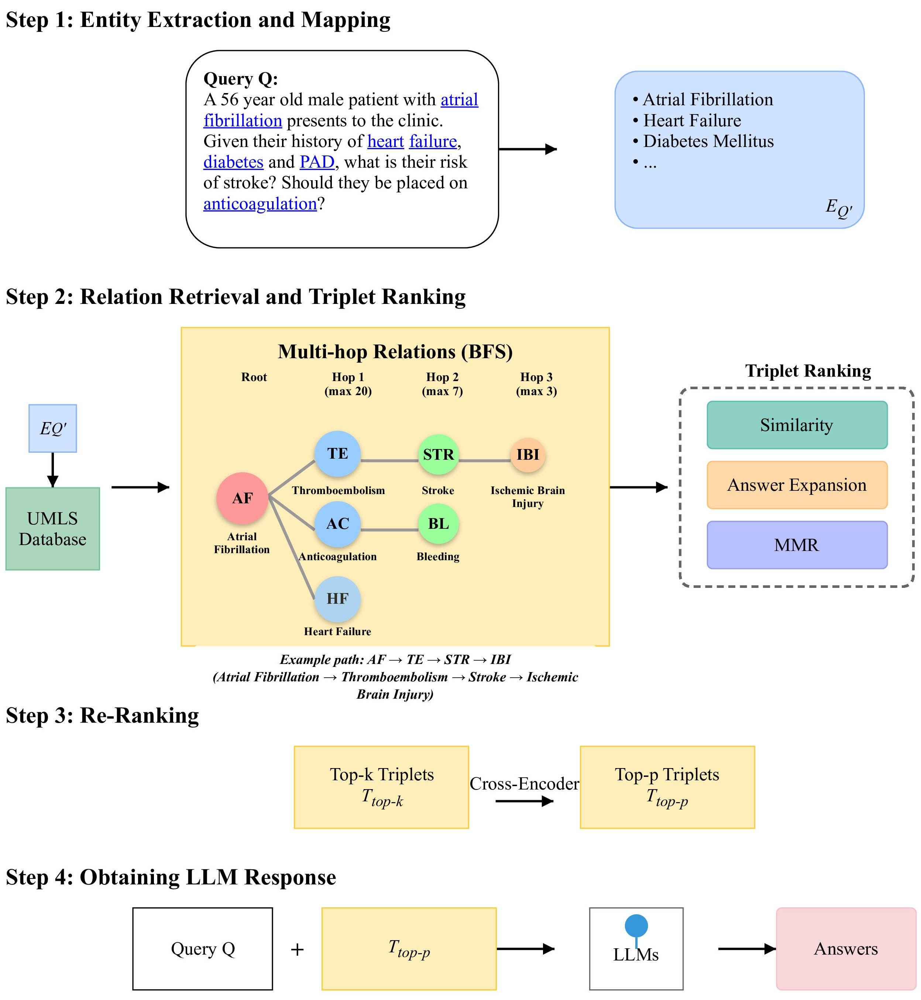

# KG-Rank+: Enhancing LLM-based Medical Question Answering with Multi-hop Knowledge Graph Traversal

[](https://opensource.org/licenses/MIT)

KG-Rank+ is an enhanced framework for medical question answering that extends the original [KG-Rank](https://github.com/YangRui525/KG-Rank) approach by incorporating controlled multi-hop knowledge graph traversal. This repository contains the implementation of our work:

*Issah, A. T., Seidu, I., & Adjei, E. A. (2024). KG-Rank+: Enhancing LLM-based Medical Question Answering with Multi-hop Knowledge Graph Traversal and Ranking Techniques.*

<!-- Framework -->
## KG-Rank Framework
<br> <!--  -->
<p align="left">
   
</p>

## Overview

Large Language Models (LLMs) like GPT-4 have shown significant potential in medical question answering but remain prone to hallucinations and factual inconsistencies, especially for complex clinical queries. KG-Rank+ addresses this challenge by extending beyond single-hop knowledge retrieval to incorporate controlled multi-hop traversal of medical knowledge graphs.

### Key Innovations:

- **Multi-hop Breadth-First Search (BFS)**: Systematically explores the UMLS knowledge graph up to three hops from the initial entities identified in a query
- **Progressive Pruning Strategy**: Applies decreasing relation limits at each hop (20→7→3) to balance knowledge coverage with computational efficiency
- **Path-aware Ranking**: Adapts existing ranking techniques to handle multi-hop knowledge paths effectively

## Repository Structure

```
├── data_preprocessing         # Scripts for preprocessing raw datasets
├── evaluation_datasets        # Preprocessed evaluation datasets
├── kg_rank_evaluation         # Evaluation scripts and tools
├── KG-Rank-UMLS               # Core implementation files for UMLS-based version
│   └── gpt4_umls.py           # Main execution script
├── KG-Rank-WikiPedia          # Implementation for open-domain version with DBpedia
├── results_multihop           # Results from multi-hop traversal experiments
├── results_singlehop          # Results from single-hop (baseline) experiments
├── scores_multihop            # Evaluation scores for multi-hop experiments
├── scores_singlehop           # Evaluation scores for single-hop experiments
├── full_evaluation_readme.md  # Instructions for evaluation setup
└── README.md                  # This file
```

## Installation

### Prerequisites

- Python 3.8+
- PyTorch 1.10+
- Access to UMLS API
- Access to an LLM (GPT-4 used in our experiments)

### Setup

1. Clone the repository:
```bash
git clone https://github.com/ahmedinhotahiru/kg-rank-plus.git
cd kg-rank-plus
```

2. Install dependencies:
```bash
pip install -r requirements.txt
```

3. Set up environment variables:
Create a `.env` file in the root directory with the following variables:
```bash
UMLS_API_KEY="your-umls-api-key"
COHERE_API_KEY="your-cohere-api-key"
OPENAI_API_KEY="your-openai-api-key"
LLAMA_TOKEN="your-huggingface-token"
```

Replace the placeholder values with your actual API keys.

## Usage

### Running the Main Pipeline

The main execution script is `gpt4_umls.py` in the `KG-Rank-UMLS` directory. You can choose which ranking method to use by changing the import statement at the top of the file:

For multi-hop traversal with MMR ranking:
```python
from multi_hop_umls_mmr_new import get_umls_keys
```

For multi-hop traversal with Answer Expansion ranking:
```python
from new_multihop_expansion import get_umls_keys
```

For multi-hop BFS traversal with expansion:
```python
from bfs_multihop_expansion import get_umls_keys
```

Execute the script:
```bash
cd KG-Rank-UMLS
python gpt4_umls.py
```

### Configuration

You can modify the following parameters in `gpt4_umls.py`:

- `input_file`: Path to the input dataset
- `model_type`: LLM model to use (e.g., "gpt4")
- `ranking_type`: Ranking method to use (e.g., "mmr", "similarity")
- `output_file`: Path to save the results

## Multi-hop BFS Traversal

The core innovation of KG-Rank+ is the multi-hop BFS traversal algorithm, which systematically explores the knowledge graph with controlled expansion:

- **Hop 1**: 20 related concepts per source entity
- **Hop 2**: 7 related concepts per hop-1 concept
- **Hop 3**: 3 related concepts per hop-2 concept

This progressive pruning strategy ensures computational efficiency while maintaining semantic depth.

## Evaluation

### Datasets

We evaluate KG-Rank+ on the LiveQA dataset, which consists of 104 test pairs of consumer health questions.

### Metrics

Our evaluation uses four complementary metrics:
- **ROUGE-L**: Measures lexical overlap and key information capture
- **BERTScore**: Assesses semantic similarity using contextual embeddings
- **BLEURT**: A learned metric trained on human judgments that evaluates semantic quality and factual accuracy
- **MoverScore**: Measures semantic similarity with Earth Mover's Distance

### Running Evaluation

To run the complete evaluation on your results:

1. Navigate to the evaluation directory:
```bash
cd kg_rank_evaluation
```

2. Run the evaluation script:
```bash
python complete_evaluation.py \
    --results_file /path/to/your/results.csv \
    --model_type gpt4 \
    --ranking_method your_ranking_method \
    --output_file evaluation_results/your_results_eval.csv
```

See `full_evaluation_readme.md` for detailed instructions on setting up and running the evaluation pipeline.

## Results

KG-Rank+ consistently outperforms the baseline KG-Rank across all ranking methods:

| Method | ROUGE-L | BERTScore | BLEURT |
|--------|---------|-----------|--------|
| Zero Shot | 19.29 (+0.40) | 82.81 (+0.31) | 45.82 (+5.98) |
| Similarity | 20.32 (+0.97) | 83.07 (+0.06) | 45.98 (+5.51) |
| Answer Expansion | 19.78 (+0.54) | 82.92 (-0.03) | 45.97 (+5.82) |
| MMR | 19.81 (+0.49) | 82.93 (+0.02) | 45.57 (+5.02) |
| Reranking (Cohere) | 19.58 (+0.86) | 82.93 (-0.01) | 45.59 (+5.52) |
| Reranking (MedCPT) | 19.68 (+0.24) | 82.96 (+0.01) | 45.86 (+5.36) |
| **Average** | **19.74 (+0.58)** | **82.94 (+0.06)** | **45.80 (+5.54)** |

*Values in parentheses show improvements over the single-hop KG-Rank baseline*

## Limitations and Future Work

- **Fixed pruning thresholds** don't adapt to query complexity
- **Reduced page retrieval** (5 pages vs. 20 in baseline) for computational efficiency
- **Random sampling** during pruning may overlook semantically important paths
- **Limited evaluation** on a single dataset

Future improvements will focus on:

1. Implementing **similarity-based path selection** to replace random sampling
2. Developing **adaptive traversal parameters** based on query complexity
3. Creating a **cross-path reasoning layer** to synthesize information
4. Expanding evaluation to **additional medical datasets** with expert assessment

## Citation

If you find this work useful, please cite our paper:

```bibtex
@article{issah2024kgrankplus,
  title={KG-Rank+: Enhancing LLM-based Medical Question Answering with Multi-hop Knowledge Graph Traversal and Ranking Techniques},
  author={Issah, Ahmed Tahiru and Seidu, Idaya and Adjei, Emmanuel Amankwaa},
  journal={},
  year={2024}
}
```

## Acknowledgements

This work builds upon the original KG-Rank framework and extends it with multi-hop capabilities. We gratefully acknowledge the authors of KG-Rank for their foundational work:

```bibtex
@misc{yang2024kgrank,
  title={KG-Rank: Enhancing Large Language Models for Medical QA with Knowledge Graphs and Ranking Techniques},
  author={Yang, Rui and Liu, Haoran and Marrese-Taylor, Edison and Zeng, Qingcheng and Ke, Yu He and Li, Wanxin and Cheng, Lechao and Chen, Qingyu and Caverlee, James and Matsuo, Yutaka and Li, Irene},
  year={2024},
  eprint={2403.05881},
  archivePrefix={arXiv},
  primaryClass={cs.CL}
}
```

## License

This project is licensed under the MIT License - see the [LICENSE](LICENSE) file for details.
